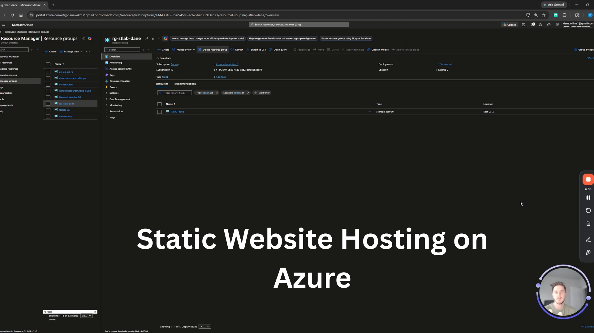

# Lab 01 — Hosting Your First Static Website in Azure

**Difficulty:** Beginner
**Estimated Time:** 30 Minutes
**Lab Series:** Azure Cloud Labs

---

## Video Walkthrough

[](https://www.loom.com/share/602af1ad1a444358bf7da30760649929)

---

---

## Overview

In this lab, you will deploy your first public-facing resource in Azure. Instead of building a complex server to host a simple website, you will use **Azure Blob Storage** with static website hosting enabled. This introduces you to the concept of **PaaS (Platform as a Service)** and **serverless hosting** — where you focus on the content and Azure handles the infrastructure.

---

## Architecture

```
User (Browser)  ──HTTPS──►  Azure Storage Account
                               └── $web Container
                                      └── index.html
```

> **Live endpoint format:**
> `https://stlab01[yourname].z13.web.core.windows.net/`

---

## Prerequisites

- [ ] Active Azure Subscription (Free Tier is fine)
- [ ] Completed Week 1 Video Modules
- [ ] A basic text editor (Notepad, TextEdit, or VS Code)

---

## Naming Conventions

Use these names throughout the lab to stay consistent.

| Resource | Value |
|---|---|
| Resource Group | `rg-lab01-[yourname]` |
| Storage Account | `stlab01[yourname]` |
| Location | East US |

> **Note:** Storage account names must be globally unique, all lowercase, and contain no special characters.

---

## Step-by-Step Instructions

### Phase 1 — Create the Resource Group

1. Log in to the [Azure Portal](https://portal.azure.com)
2. Search for **Resource Groups** in the top search bar
3. Click **+ Create**
4. Fill in the **Basics** tab:
   - **Subscription:** Select your subscription
   - **Resource Group:** `rg-lab01-[yourname]`
   - **Region:** (US) East US
5. Click **Review + create** → **Create**

---

### Phase 2 — Create the Storage Account

1. Search for **Storage accounts** in the search bar
2. Click **+ Create**
3. Fill in the **Basics** tab:
   - **Resource Group:** `rg-lab01-[yourname]`
   - **Storage account name:** `stlab01[yourname]` *(e.g., `stlab01jhante`)*
   - **Region:** (US) East US
   - **Performance:** Standard
   - **Redundancy:** Locally-redundant storage (LRS)
4. Click **Review + create** → **Create**
5. Once deployment completes, click **Go to resource**

---

### Phase 3 — Enable Static Website Hosting

1. In the left-hand menu of your Storage Account, find the **Data management** section
2. Click **Static website**
3. Toggle from **Disabled** → **Enabled**
4. Set **Index document name** to `index.html`
5. Set **Error document path** to `404.html` *(optional but recommended)*
6. Click **Save**

> **Important:** Once saved, copy the **Primary endpoint URL** that appears — this is your website's public address.

---

### Phase 4 — The Website File

This lab uses a custom `index.html` — a real portfolio/resume page rather than a boilerplate placeholder. The file is structured as a personal cloud resume and includes:

- Navigation with smooth scroll
- About Me section referencing Azure and cloud skills
- Certifications section (AZ-900, AWS CCP, Security+, Network+, and more)
- Work experience section
- Skills & Tech overview
- Social links (LinkedIn, GitHub)

The page was hosted on **Azure Front Door** in its deployed version, with a visitor counter planned as a future enhancement via Azure Functions and Cosmos DB.

> You can swap in your own `index.html` or use the one provided in this repository.

---

### Phase 5 — Upload Your Content

1. In the Azure Portal, navigate back to your Storage Account
2. In the left menu, click **Containers** (under Data storage)
3. Open the **`$web`** container — this was created automatically when you enabled static hosting
4. Click **Upload** at the top
5. Browse for your `index.html` file
6. Click **Upload**

---

### Phase 6 — Validate

1. Open a new browser tab
2. Paste your **Primary endpoint URL** from Phase 3
3. Press Enter

You should see your page live. Congratulations — you just deployed a serverless website on Azure.

---

## Troubleshooting

| Issue | Fix |
|---|---|
| `404 - The requested content does not exist` | Check the filename is exactly `index.html` (case-sensitive). Confirm the file was uploaded to the `$web` container, not another container. |
| `Storage account name is already taken` | Storage names are globally unique across all of Azure. Add random numbers to the end (e.g., `stlab01jhante99`). |

---

## Clean Up Resources

Always clean up after a lab to avoid unexpected charges and keep your environment tidy.

1. Go to **Resource Groups**
2. Click `rg-lab01-[yourname]`
3. Click **Delete resource group**
4. Type the resource group name to confirm
5. Click **Delete**

---

## What I Learned

Enabling Static Website hosting on Azure Blob Storage removed the need for a server entirely. The storage service itself becomes the delivery mechanism — there's no compute to provision, no web server to configure, and no ports to manage. This is what PaaS and serverless hosting look like in practice, and seeing it work live in the portal reframes how you think about cloud infrastructure from day one.

---

## What I'd Do Differently

I would add a **custom domain** and route traffic through **Azure Front Door** from the start. The default endpoint works and is HTTPS-enabled, but mapping a custom domain makes the project feel production-grade and is a much stronger portfolio piece. The technical steps aren't far off from what's already in this lab — and the credibility difference when sharing your work is significant.

---

## Resources

- [Azure Blob Storage Documentation](https://learn.microsoft.com/en-us/azure/storage/blobs/)
- [Static Website Hosting in Azure Storage](https://learn.microsoft.com/en-us/azure/storage/blobs/storage-blob-static-website)
- [Azure Free Account](https://azure.microsoft.com/en-us/free/)

---

## Connect

- [LinkedIn](https://www.linkedin.com/in/dane-willms-3612a9281/)
- [GitHub](https://github.com/dane139)

---

*Part of an ongoing Azure Cloud Lab series documenting hands-on learning in Infrastructure, DevOps, Networking, and Security.*
